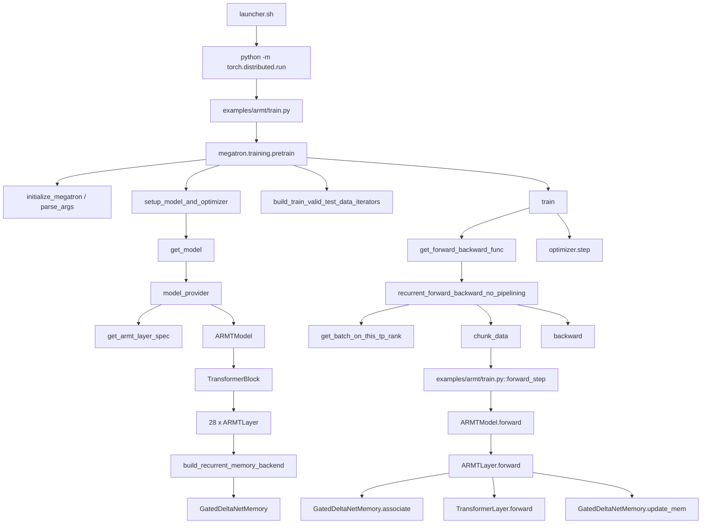

# ARMT 使用 GDN Memory Backend 的训练调用关系梳理

本文从 launcher `playground/rmt/qwen3_0p6b_armt_gdn_0324_fs_wo_tbptt_nmem64_w_norm.sh` 出发，按实际代码调用顺序梳理：

1. shell 脚本如何组装训练命令
2. Megatron 如何解析参数并构建 ARMT 模型
3. 训练主循环如何切到 recurrent schedule
4. 单个 microbatch / chunk 如何进入 ARMT layer
5. `gated_deltanet` memory backend 如何完成读写 memory

本文聚焦 **训练路径**，不是 checkpoint 转换或推理路径。

---

## 1. 一眼看懂主调用链



如果只看最关键的两个开关：

- `--use-recurrent-model-schedule`：决定训练时走 recurrent chunk schedule，而不是普通 GPT schedule
- `--recurrent-memory-backend gated_deltanet`：决定每层 ARMT memory backend 选 GDN，而不是 associative / cross_attn_slots

对应位置：

- `playground/rmt/qwen3_0p6b_armt_gdn_0324_fs_wo_tbptt_nmem64_w_norm.sh:229`
- `playground/rmt/qwen3_0p6b_armt_gdn_0324_fs_wo_tbptt_nmem64_w_norm.sh:234`
- `megatron/core/pipeline_parallel/schedules.py:153`
- `megatron/core/models/armt/recurrent_memory.py:13`

---

## 2. Launcher 层：脚本到底传了什么

脚本最终执行的是：

- `python -m torch.distributed.run ... examples/armt/train.py ...`
- 位置：`playground/rmt/qwen3_0p6b_armt_gdn_0324_fs_wo_tbptt_nmem64_w_norm.sh:361`

### 2.1 与本问题最相关的 ARMT / GDN 参数

脚本中 `ARMT_ARGS` 的核心参数如下：

- `--use-recurrent-model-schedule`
- `--num-mem-tokens 64`
- `--armt-chunk-size 512`
- `--armt-n-heads 16`
- `--recurrent-memory-backend gated_deltanet`
- `--recurrent-gdn-conv-kernel-size 4`
- `--recurrent-gdn-key-head-dim 64`
- `--recurrent-gdn-value-head-dim 64`
- `--recurrent-gdn-num-key-heads 16`
- `--recurrent-gdn-num-value-heads 16`
- `--no-read-memory-from-first-chunk`
- `--no-recurrent-tbptt-mode`
- `--recurrent-gdn-use-fla-kernel`
- `--recurrent-gdn-use-causal-conv1d`
- `--recurrent-mem-qk-norm`
- `--recurrent-memory-input-pre-norm`

对应代码：

- `playground/rmt/qwen3_0p6b_armt_gdn_0324_fs_wo_tbptt_nmem64_w_norm.sh:229`
- `playground/rmt/qwen3_0p6b_armt_gdn_0324_fs_wo_tbptt_nmem64_w_norm.sh:241`
- `playground/rmt/qwen3_0p6b_armt_gdn_0324_fs_wo_tbptt_nmem64_w_norm.sh:246`
- `playground/rmt/qwen3_0p6b_armt_gdn_0324_fs_wo_tbptt_nmem64_w_norm.sh:249`
- `playground/rmt/qwen3_0p6b_armt_gdn_0324_fs_wo_tbptt_nmem64_w_norm.sh:254`
- `playground/rmt/qwen3_0p6b_armt_gdn_0324_fs_wo_tbptt_nmem64_w_norm.sh:259`
- `playground/rmt/qwen3_0p6b_armt_gdn_0324_fs_wo_tbptt_nmem64_w_norm.sh:264`

### 2.2 这个脚本对应的运行语义

这个 launcher 的默认配置意味着：

- 模型是 ARMT，不是普通 GPT
- recurrent memory backend 是 `gated_deltanet`
- 训练 schedule 是 recurrent schedule
- 一个序列长度是 `1024`
- 每个 recurrent chunk 长度是 `512`
- 每个 chunk 会拼上 `64` 个 memory tokens
- 首个 chunk 不读历史 memory
- no-TBPTT：一个 microbatch 内所有 chunks 的图是连着的，最后统一 backward

相关代码：

- `playground/rmt/qwen3_0p6b_armt_gdn_0324_fs_wo_tbptt_nmem64_w_norm.sh:131`
- `playground/rmt/qwen3_0p6b_armt_gdn_0324_fs_wo_tbptt_nmem64_w_norm.sh:143`
- `playground/rmt/qwen3_0p6b_armt_gdn_0324_fs_wo_tbptt_nmem64_w_norm.sh:144`

---

## 3. Python 入口：`examples/armt/train.py`

训练入口文件是：

- `examples/armt/train.py`

主入口在：

- `examples/armt/train.py:159`

它最终调用：

- `pretrain(train_valid_test_datasets_provider, model_provider, ModelType.encoder_or_decoder, forward_step, ..., extra_args_provider=add_armt_args)`
- 位置：`examples/armt/train.py:165`

这一步有三个关键点：

1. 数据集构造复用 `pretrain_gpt.py` 里的 provider
2. loss 也复用 `pretrain_gpt.py::loss_func`
3. 但模型构建和 forward_step 是 ARMT 自己的

对应代码：

- `examples/armt/train.py:18`
- `examples/armt/train.py:41`
- `examples/armt/train.py:138`

---

## 4. 参数解析与约束校验

### 4.1 参数是怎么注册进 argparse 的

`pretrain()` 先调用 `initialize_megatron(...)`：

- `megatron/training/training.py:772`

`initialize_megatron()` 内部会调用：

- `parse_args(extra_args_provider, ignore_unknown_args)`
- `megatron/training/initialize.py:71`
- `megatron/training/arguments.py:88`

这里 `extra_args_provider=add_armt_args`，所以 ARMT / recurrent 参数都会注册进去。

### 4.2 `add_armt_args()` 又是怎么接上 recurrent args 的

`add_armt_args()` 先调用：

- `add_recurrent_args(parser)`
- `examples/armt/armt_args.py:8`
- `examples/armt/armt_args.py:9`

也就是说：

- `--use-recurrent-model-schedule`
- `--recurrent-memory-backend`
- `--recurrent-gdn-*`
- `--recurrent-mem-qk-norm`
- `--recurrent-memory-input-pre-norm`

这些 canonical flag 真正定义在：

- `examples/recurrent/recurrent_args.py:41`
- `examples/recurrent/recurrent_args.py:141`
- `examples/recurrent/recurrent_args.py:147`
- `examples/recurrent/recurrent_args.py:160`
- `examples/recurrent/recurrent_args.py:227`
- `examples/recurrent/recurrent_args.py:233`

### 4.3 约束在哪校验

真正的校验发生在 `model_provider()` 里：

- `validate_armt_constraints(args)`
- `examples/armt/train.py:44`

它会继续调用 shared recurrent 校验：

- `examples/armt/armt_args.py:98`
- `examples/recurrent/recurrent_args.py:275`

对这条 launcher，最重要的约束包括：

- PP 必须是 1
- CP 必须是 1
- 位置编码必须是 `rope` 或 `yarn`
- GDN backend 必须显式提供 key/value head dim 和 head 数
- `recurrent_gdn_num_value_heads` 必须是 `recurrent_gdn_num_key_heads` 的整数倍
- key/value head 数还必须被 TP 整除
- 如果打开 `recurrent_gdn_use_fla_kernel`，则必须安装 `fla`
- 如果打开 `recurrent_gdn_use_causal_conv1d`，则必须安装 `causal_conv1d`

相关代码：

- `examples/recurrent/recurrent_args.py:325`
- `examples/recurrent/recurrent_args.py:344`
- `examples/recurrent/recurrent_args.py:356`
- `examples/recurrent/recurrent_args.py:391`

---

## 5. 模型构建：怎么从 GPT 变成 ARMT + GDN

### 5.1 训练框架侧先走 `setup_model_and_optimizer()`

`pretrain()` 在初始化后，会先构建模型与优化器：

- `megatron/training/training.py:907`
- `megatron/training/training.py:1622`

其中模型构建的入口是：

- `get_model(model_provider, ...)`
- `megatron/training/training.py:1634`
- `megatron/training/training.py:1344`

### 5.2 `model_provider()` 里做了什么

`examples/armt/train.py::model_provider()` 的关键逻辑：

1. 校验 ARMT / recurrent 参数
2. no-TBPTT 时关闭不兼容的 fused kernels
3. 由 `core_transformer_config_from_args(args)` 生成 Megatron transformer config
4. 调 `get_armt_layer_spec(...)`
5. 构建 `ARMTModel(...)`

对应代码：

- `examples/armt/train.py:45`
- `examples/armt/train.py:59`
- `examples/armt/train.py:61`
- `examples/armt/train.py:66`
- `examples/armt/train.py:110`

### 5.3 `get_armt_layer_spec()` 做了“换心脏”的事

`get_armt_layer_spec()` 会基于 GPT layer spec 替换 transformer layer：

#### 替换：TransformerLayer -> ARMTLayer

- `megatron/core/models/armt/armt_layer_specs.py:87`

这意味着每层都会变成“标准 self-attention/MLP + recurrent memory read/write”的增强版本。

### 5.4 `ARMTModel` 仍然套在 GPTModel 外壳上

`ARMTModel` 继承自 `GPTModel`：

- `megatron/core/models/armt/armt_model.py:18`

而 `GPTModel` 会创建：

- `self.decoder = TransformerBlock(config, spec=transformer_layer_spec, ...)`
- `megatron/core/models/gpt/gpt_model.py:209`

最终 `TransformerBlock` 会按 `num_layers=28` 实例化出 28 层：

- `megatron/core/transformer/transformer_block.py:357`
- `megatron/core/transformer/transformer_block.py:367`

### 5.5 每个 `ARMTLayer` 如何绑定 GDN backend

在 `ARMTLayer.__init__()` 中：

- 如果 `recurrent_memory_backend == "associative"`，构造 `AssociativeLayer`
- 如果 `recurrent_memory_backend == "cross_attn_slots"`，构造 `CrossAttentionSlotMemory`
- 否则这里会走 GDN 分支，构造 `GatedDeltaNetMemory`

关键代码：

- `megatron/core/models/armt/armt_layer.py:77`
- `megatron/core/models/armt/armt_layer.py:91`
- `megatron/core/models/armt/armt_layer.py:103`
- `megatron/core/models/armt/recurrent_memory.py:10`
- `megatron/core/models/armt/recurrent_memory.py:13`

所以更准确地说：

> 不是“整个模型只有一个 GDN backend”，而是“28 个 ARMTLayer，每层各自持有一个 `GatedDeltaNetMemory` 实例”。

---

## 6. 训练主循环：何时切到 recurrent schedule

### 6.1 `train()` 会拿当前的 forward/backward schedule

训练主循环在：

- `megatron/training/training.py:2629`

其中：

- `forward_backward_func = get_forward_backward_func()`
- `megatron/training/training.py:2819`

### 6.2 `get_forward_backward_func()` 根据 `use_recurrent_model_schedule` 切换

核心逻辑：

- 读取全局 args
- 如果 `use_recurrent_model_schedule=True`
- 且 PP 不是 1 就直接报错
- 否则返回 `recurrent_forward_backward_no_pipelining`

代码位置：

- `megatron/core/pipeline_parallel/schedules.py:144`
- `megatron/core/pipeline_parallel/schedules.py:153`
- `megatron/core/pipeline_parallel/schedules.py:159`

因此，这个 launcher 的训练 forward/backward 不走普通 schedule，而是走：

- `megatron/core/pipeline_parallel/recurrent_schedules.py::recurrent_forward_backward_no_pipelining`

### 6.3 `train_step()` 什么时候真正调用它

`train_step()` 里会执行：

- `losses_reduced = forward_backward_func(...)`
- `megatron/training/training.py:1840`

随后才执行：

- `optimizer.step()`
- `megatron/training/training.py:1891`

---

## 7. Recurrent schedule 内部：一个 iteration 是怎么切 chunk 的

recurrent schedule 主体在：

- `megatron/core/pipeline_parallel/recurrent_schedules.py:178`

### 7.1 先拿 batch，再沿序列维切 chunk

对于每个 microbatch：

1. `get_batch_on_this_tp_rank(data_iterator)` 取出 batch
2. `chunk_data(raw_batch, chunk_size, seq_length)` 按序列维切块

相关代码：

- `megatron/core/pipeline_parallel/recurrent_schedules.py:251`
- `megatron/core/pipeline_parallel/recurrent_schedules.py:254`
- `megatron/core/pipeline_parallel/recurrent_schedules.py:256`
- `megatron/training/utils.py:516`
- `megatron/core/pipeline_parallel/recurrent_schedules.py:48`

对这条 launcher：

- `seq_length=1024`
- `chunk_size=512`

所以每个 microbatch 会切成 2 个 chunks。

### 7.2 每个 microbatch 开头先 reset 全模型 memory

在 schedule 中：

- 如果模型有 `reset_all_memory()`，会在每个 microbatch 开头调用
- `megatron/core/pipeline_parallel/recurrent_schedules.py:274`

对应到 `ARMTModel`：

- `ARMTModel.reset_all_memory()` 会遍历所有 ARMTLayer 并调用 `reset_memory()`
- `megatron/core/models/armt/armt_model.py:144`
- `megatron/core/models/armt/armt_model.py:148`

这说明：

> GDN memory state 是在一个 microbatch 内跨 chunk 保留，但不会跨 microbatch 保留。

### 7.3 每个 chunk 开始前，会把 chunk 状态写回模型

schedule 调用：

- `_set_recurrent_chunk_model_state(...)`
- `megatron/core/pipeline_parallel/recurrent_schedules.py:145`

它会设置三件事：

- `current_chunk_is_first`
- `skip_read_memory_for_current_chunk`
- `current_chunk_start_position`

对应代码：

- `megatron/core/pipeline_parallel/recurrent_schedules.py:148`
- `megatron/core/pipeline_parallel/recurrent_schedules.py:151`
- `megatron/core/pipeline_parallel/recurrent_schedules.py:159`

这个状态会继续传到：

- `ARMTModel.set_current_chunk_is_first()`
- `ARMTModel.set_skip_read_memory_for_current_chunk()`
- `megatron/core/models/armt/armt_model.py:157`
- `megatron/core/models/armt/armt_model.py:162`

再进一步传到每个 `ARMTLayer`。

### 7.4 no-TBPTT 和 TBPTT 在 schedule 里的差别

本脚本打开的是：

- `--no-recurrent-tbptt-mode`

schedule 中对应逻辑是：

- TBPTT 模式：每个 chunk 立刻 backward
- no-TBPTT 模式：先累计所有 chunks 的 loss，最后一次性 backward

代码：

- `megatron/core/pipeline_parallel/recurrent_schedules.py:315`
- `megatron/core/pipeline_parallel/recurrent_schedules.py:316`
- `megatron/core/pipeline_parallel/recurrent_schedules.py:318`
- `megatron/core/pipeline_parallel/recurrent_schedules.py:372`
- `megatron/core/pipeline_parallel/recurrent_schedules.py:381`

因此这个 launcher 的 chunk 之间会共享一条完整的 autograd 图。

---

## 8. Chunk 内 forward：`examples/armt/train.py::forward_step()`

每个 chunk 最终会调用：

- `examples/armt/train.py::forward_step`
- `examples/armt/train.py:138`

它做的事情很直接：

1. `batch = next(data_iterator)`，这里取到的已经是 schedule 切好的单个 chunk
2. 取出 `tokens / labels / loss_mask / attention_mask / position_ids`
3. 调 `model(...)`
4. 返回 `output_tensor` 和 `partial(loss_func, loss_mask, model=model)`

对应代码：

- `examples/armt/train.py:139`
- `examples/armt/train.py:147`
- `examples/armt/train.py:156`

loss 仍然复用 GPT 的：

- `pretrain_gpt.py::loss_func`
- `pretrain_gpt.py:147`

它返回：

- `loss`
- `num_tokens`
- `{'lm loss': [loss_sum, token_count]}`

所以 recurrent schedule 后面才能做跨 chunk / 跨 microbatch 的 loss 聚合。

---

## 9. `ARMTModel.forward()`：memory tokens 是在哪里拼进去的

`ARMTModel.forward()` 在：

- `megatron/core/models/armt/armt_model.py:313`

### 9.1 `_preprocess()` 先把 memory embeddings 拼到序列尾部

核心流程：

1. 调父类 GPT `_preprocess()` 生成 decoder input
2. 将可学习参数 `self.memory_embeddings` 扩展到 batch 维
3. 与原始 token hidden states 在序列维拼接
4. 如有 padding mask，也同步扩展
5. 重新生成适配新长度的 rotary embedding

关键代码：

- `megatron/core/models/armt/armt_model.py:187`
- `megatron/core/models/armt/armt_model.py:171`
- `megatron/core/models/armt/armt_model.py:239`
- `megatron/core/models/armt/armt_model.py:243`

对于当前脚本：

- 每个 chunk 原始长度是 `512`
- 拼上 `64` 个 memory tokens
- 所以 layer 内部真正处理的序列长度是 `576`

### 9.2 attention mask 也会被扩成包含 memory tokens 的版本

- `ARMTModel._adjust_attention_mask()`
- `megatron/core/models/armt/armt_model.py:277`

### 9.3 跑完 decoder 后再把 memory tokens 裁掉

- `ARMTModel._strip_memory_tokens()`
- `megatron/core/models/armt/armt_model.py:299`
- `megatron/core/models/armt/armt_model.py:369`

所以最终 LM loss 只落在原始真实 token 上，不会对那 64 个 memory tokens 算语言模型损失。

---

## 10. Decoder 内：每层 `ARMTLayer.forward()` 的顺序

`TransformerBlock` 在 forward 中会逐层调用：

- `layer(hidden_states=..., attention_mask=..., ...)`
- `megatron/core/transformer/transformer_block.py:490`

而这里的 `layer` 已经是 `ARMTLayer`。

`ARMTLayer.forward()` 在：

- `megatron/core/models/armt/armt_layer.py:264`

其执行顺序可以概括为：

```text
输入 hidden_states
  -> Step 1: memory associate() 读 memory
  -> Step 2: 把 retrieved states 残差加回 hidden_states
  -> Step 3: 跑标准 TransformerLayer.forward()，即 attention + MLP
  -> Step 4: 从输出尾部切出 memory tokens
  -> Step 5: update_mem() 写回 memory
  -> 返回 hidden_states
```

对应代码：

- `megatron/core/models/armt/armt_layer.py:275`
- `megatron/core/models/armt/armt_layer.py:277`
- `megatron/core/models/armt/armt_layer.py:280`
- `megatron/core/models/armt/armt_layer.py:297`
- `megatron/core/models/armt/armt_layer.py:309`

### 10.1 Step 1：读 memory

```python
retrieved = memory_layer.associate(hidden_states, input_is_sbh=input_is_sbh)
hidden_states = hidden_states + retrieved
```

这一步里 `memory_layer` 对当前脚本来说就是 `GatedDeltaNetMemory`。

### 10.2 Step 2/3：标准 Transformer layer

`super().forward(...)` 调到父类 `TransformerLayer.forward()`：

- `megatron/core/models/armt/armt_layer.py:280`
- `megatron/core/transformer/transformer_layer.py:595`
- `megatron/core/transformer/transformer_layer.py:705`

也就是：

- input layernorm
- self attention
- residual / bias-dropout-add
- pre-MLP layernorm
- MLP
- residual / bias-dropout-add

### 10.3 Step 4：从 layer 输出中切出 memory token 段

`ARMTLayer` 假设 memory tokens 位于序列尾部：

- `context_part = hidden_states[:-self.num_mem_tokens, :, :]`
- `mem_part = hidden_states[-self.num_mem_tokens :, :, :]`
- `megatron/core/models/armt/armt_layer.py:297`
- `megatron/core/models/armt/armt_layer.py:299`

然后只把 `mem_part` 送去 `update_mem()`。

---

## 11. GDN backend：`GatedDeltaNetMemory` 的构造与状态

GDN backend 实现在：

- `megatron/core/models/armt/gated_deltanet_memory.py`

### 11.1 构造参数来源

`ARMTLayer.__init__()` 把 config 和 GDN 超参数传给：

- `GatedDeltaNetMemory(config=config, conv_kernel_size=..., key_head_dim=..., value_head_dim=..., num_key_heads=..., num_value_heads=..., use_fla_kernel=..., use_causal_conv1d=..., use_qk_l2norm=..., use_input_pre_norm=...)`
- `megatron/core/models/armt/armt_layer.py:103`
- `megatron/core/models/armt/armt_layer.py:114`

### 11.2 GDN backend 内部的关键参数/模块

`GatedDeltaNetMemory.__init__()` 会构造：

- `in_proj`
- depth-wise `conv1d`
- `dt_bias`
- `A_log`
- `out_norm`
- `out_proj`
- 可选的 `input_pre_norm`
- 非持久 buffer：`recurrent_state`

代码位置：

- `megatron/core/models/armt/gated_deltanet_memory.py:119`
- `megatron/core/models/armt/gated_deltanet_memory.py:125`
- `megatron/core/models/armt/gated_deltanet_memory.py:134`
- `megatron/core/models/armt/gated_deltanet_memory.py:136`
- `megatron/core/models/armt/gated_deltanet_memory.py:137`
- `megatron/core/models/armt/gated_deltanet_memory.py:139`
- `megatron/core/models/armt/gated_deltanet_memory.py:150`

### 11.3 GDN memory state 的形状

`get_memory_state_breakdown()` 给出的逻辑大小是：

- `[batch_size, num_value_heads, key_head_dim, value_head_dim]`
- `megatron/core/models/armt/gated_deltanet_memory.py:248`
- `megatron/core/models/armt/gated_deltanet_memory.py:255`

对这个 launcher 默认值：

- `num_value_heads = 16`
- `key_head_dim = 64`
- `value_head_dim = 64`

所以单层单样本的 `W_mem` 大小是：

- `16 * 64 * 64`

---

## 12. GDN 读路径：`associate()`

读路径在：

- `megatron/core/models/armt/gated_deltanet_memory.py:490`

它的逻辑可以分成两种情况。

### 12.1 首 chunk：直接返回零 retrieval

如果当前还是 first chunk：

- `result = torch.zeros_like(hidden_states)`
- `megatron/core/models/armt/gated_deltanet_memory.py:503`

这与 launcher 里 `--no-read-memory-from-first-chunk` 一起配合，使首 chunk 不读取历史 memory。

更上层的首 chunk 跳读控制在：

- `recurrent_schedules.py::_set_recurrent_chunk_model_state()`
- `ARMTModel.set_skip_read_memory_for_current_chunk()`
- `ARMTLayer.set_skip_read_memory_for_current_chunk()`
- `megatron/core/pipeline_parallel/recurrent_schedules.py:151`
- `megatron/core/models/armt/armt_model.py:129`
- `megatron/core/models/armt/armt_layer.py:128`

### 12.2 非首 chunk：真正基于 recurrent_state 做读取

对于后续 chunk，`associate()` 流程是：

1. 将输入从 SBH 转到 batch-first
2. 如果 TP 下 hidden size 被切分，则先 gather
3. 如开启 `input_pre_norm`，先归一化输入
4. 通过 `in_proj` 投影出 `query / gate / alpha` 等
5. 对 qkv 做 causal conv
6. 如开启 `recurrent_mem_qk_norm`，做 q/k 归一化
7. 构造一个“只读不写”的 gated delta rule 调用：
   - `zero_key`
   - `zero_value`
   - `beta = 0`
   - `initial_state = self.recurrent_state`
8. 得到 `core_attn_out`
9. 用 output gate + `out_proj` 投影回 hidden size
10. 如有 TP，再 scatter 回去

关键代码：

- `megatron/core/models/armt/gated_deltanet_memory.py:491`
- `megatron/core/models/armt/gated_deltanet_memory.py:494`
- `megatron/core/models/armt/gated_deltanet_memory.py:506`
- `megatron/core/models/armt/gated_deltanet_memory.py:510`
- `megatron/core/models/armt/gated_deltanet_memory.py:512`
- `megatron/core/models/armt/gated_deltanet_memory.py:521`
- `megatron/core/models/armt/gated_deltanet_memory.py:530`

可以把它理解成：

> `associate()` 不是从一个离散 token cache 里做 attention 读取，而是用当前输入 query 去查询上一个 chunk 写下来的连续 recurrent state `W_mem`。

---

## 13. GDN 写路径：`update_mem()`

写路径在：

- `megatron/core/models/armt/gated_deltanet_memory.py:538`

输入是本层输出尾部的 memory token hidden states，而不是整段上下文 token。

### 13.1 写路径的执行步骤

1. 把 `mem_tokens` 转成 batch-first
2. 必要时 gather TP 分片
3. 初始化或复用 `self.recurrent_state`
4. 根据 TBPTT / no-TBPTT 决定是否 `detach`
5. 对 `mem_tokens` 做投影，得到 `query/key/value/beta/alpha`
6. 计算 decay `g` 与 write gate `beta`
7. 调 gated delta rule，输出 `final_state`
8. 计算 `delta_state = final_state - initial_state`
9. `self.recurrent_state = final_state`
10. 记录监控指标
11. 标记 `_first_chunk = False`

相关代码：

- `megatron/core/models/armt/gated_deltanet_memory.py:539`
- `megatron/core/models/armt/gated_deltanet_memory.py:544`
- `megatron/core/models/armt/gated_deltanet_memory.py:546`
- `megatron/core/models/armt/gated_deltanet_memory.py:552`
- `megatron/core/models/armt/gated_deltanet_memory.py:556`
- `megatron/core/models/armt/gated_deltanet_memory.py:557`
- `megatron/core/models/armt/gated_deltanet_memory.py:567`
- `megatron/core/models/armt/gated_deltanet_memory.py:568`
- `megatron/core/models/armt/gated_deltanet_memory.py:591`

### 13.2 no-TBPTT 在这里的关键影响

代码里：

- TBPTT 模式：
  - `mem_tokens = mem_tokens.detach()`
  - `initial_state = self.recurrent_state.detach()`
- no-TBPTT 模式：
  - `initial_state = self.recurrent_state`

对应代码：

- `megatron/core/models/armt/gated_deltanet_memory.py:546`
- `megatron/core/models/armt/gated_deltanet_memory.py:548`
- `megatron/core/models/armt/gated_deltanet_memory.py:550`

因此本 launcher 的 no-TBPTT 语义是：

> chunk0 写出的 recurrent state 与 chunk1 的读取/写入仍在同一张计算图里，梯度可以跨 chunk 回传。

---

## 14. Gated delta rule 实际调用到哪里

GDN backend 最终会调用 `_run_gated_delta_rule()`：

- `megatron/core/models/armt/gated_deltanet_memory.py:444`

内部两条路径：

### 14.1 优先路径：FLA kernel

如果 `use_fla_kernel=True`：

- 调 `chunk_gated_delta_rule(...)`
- `megatron/core/models/armt/gated_deltanet_memory.py:454`

### 14.2 fallback：torch 实现

否则走：

- `torch_chunk_gated_delta_rule(...)`
- `megatron/core/models/armt/gated_deltanet_memory.py:468`
- `megatron/core/ssm/gated_delta_net.py:572`

也就是说，这个 launcher 默认是：

- 优先用 FLA 的 gated delta rule kernel
- qkv 前处理优先用 `causal_conv1d` kernel
- 如果依赖缺失，会在参数校验阶段直接失败，而不是静默降级

对应约束见：

- `examples/recurrent/recurrent_args.py:391`
- `examples/recurrent/recurrent_args.py:396`

---

## 15. Full attention 这条脚本实际上走的是哪条路径

当前 ARMT 不再替换 self-attention；这份 launcher 的 full attention 直接走 GPT layer spec 里的标准 self-attention。

代码：

- `examples/recurrent/recurrent_args.py:275`
- `megatron/core/models/armt/armt_layer_specs.py:87`

这意味着：

> 当前 launcher 的关键变化点是 memory backend 变成 GDN；full attention 不再有 ARMT 专属跨 chunk 覆盖逻辑。

---

## 16. 把一次 microbatch 展开成时序图

以本脚本默认配置为例：

- `seq_length = 1024`
- `chunk_size = 512`
- `num_mem_tokens = 64`
- `no_read_memory_from_first_chunk = True`
- `no_recurrent_tbptt_mode = True`

一个 microbatch 的执行过程可以理解成：

### 16.1 microbatch 开始

- schedule 取出完整 batch
- 切成 `chunk0` 和 `chunk1`
- `ARMTModel.reset_all_memory()`
- 每层 `ARMTLayer.reset_memory()`
- 每层 GDN `recurrent_state` 清零/待初始化

### 16.2 `chunk0`

- schedule 标记：`is_first_chunk=True`
- schedule 标记：`skip_read_memory=True`
- `ARMTModel.forward(chunk0)`
- 每层 `ARMTLayer.forward()`：
  - 跳过 `associate()`
  - 跑 attention + MLP
  - 从输出尾部拿出 64 个 memory tokens
  - `GatedDeltaNetMemory.update_mem(mem_tokens)`
  - 生成该层的 `recurrent_state`
- schedule 只累计 loss，不立刻 backward

### 16.3 `chunk1`

- schedule 标记：`is_first_chunk=False`
- schedule 标记：`skip_read_memory=False`
- `ARMTModel.forward(chunk1)`
- 每层 `ARMTLayer.forward()`：
  - `GatedDeltaNetMemory.associate(hidden_states)` 读取 chunk0 留下的 recurrent_state
  - 将 retrieved states 残差加回当前 hidden_states
  - 跑 attention + MLP
  - 再用新的 memory tokens 更新 recurrent_state
- schedule 继续累计 loss

### 16.4 microbatch 结束

- no-TBPTT：对该 microbatch 的累计 loss 一次性 backward
- 所有 microbatches 跑完后，做 grad finalize
- `optimizer.step()`

对应代码：

- `megatron/core/pipeline_parallel/recurrent_schedules.py:274`
- `megatron/core/pipeline_parallel/recurrent_schedules.py:343`
- `megatron/core/pipeline_parallel/recurrent_schedules.py:381`
- `megatron/training/training.py:1891`

---

## 17. 默认 8 卡配置下，一次 iteration 大概会发生多少次 chunk forward

按 launcher 默认值：

- `micro_batch_size = 15`
- `global_batch_size = 480`
- `GPUS_PER_NODE = 8`
- `TP = 1, PP = 1, CP = 1`

见：

- `playground/rmt/qwen3_0p6b_armt_gdn_0324_fs_wo_tbptt_nmem64_w_norm.sh:40`
- `playground/rmt/qwen3_0p6b_armt_gdn_0324_fs_wo_tbptt_nmem64_w_norm.sh:120`
- `playground/rmt/qwen3_0p6b_armt_gdn_0324_fs_wo_tbptt_nmem64_w_norm.sh:161`
- `playground/rmt/qwen3_0p6b_armt_gdn_0324_fs_wo_tbptt_nmem64_w_norm.sh:162`

在默认单机 8 卡下，可推得：

- DP = 8
- 每次 iteration 的 microbatch 数约为 `480 / (15 * 8) = 4`
- 每个 microbatch 有 2 个 chunks

因此每卡每 iteration 会执行约：

- `4 * 2 = 8` 次 chunk forward

这是基于当前 launcher 默认并行配置的推导，不是代码里写死的常量。

---

## 18. 最终可记忆版：核心调用关系清单

如果只需要保留最关键的“调用关系骨架”，可以记下面这条：

```text
qwen3_0p6b_armt_gdn_0324_fs_wo_tbptt_nmem64_w_norm.sh
  -> torch.distributed.run
  -> examples/armt/train.py::__main__
  -> megatron.training.pretrain()
  -> initialize_megatron(parse_args + add_armt_args)
  -> setup_model_and_optimizer()
  -> get_model(model_provider)
  -> examples/armt/train.py::model_provider()
  -> get_armt_layer_spec()
  -> ARMTModel(...)
  -> GPTModel.decoder = TransformerBlock(...)
  -> 28 x ARMTLayer(...)
  -> build_recurrent_memory_backend("gated_deltanet")
  -> GatedDeltaNetMemory(...)
  -> train()
  -> get_forward_backward_func()
  -> recurrent_forward_backward_no_pipelining()
  -> get_batch_on_this_tp_rank()
  -> chunk_data()
  -> examples/armt/train.py::forward_step()
  -> ARMTModel.forward()
  -> ARMTLayer.forward()
      -> GatedDeltaNetMemory.associate()
      -> TransformerLayer.forward()
      -> GatedDeltaNetMemory.update_mem()
  -> backward
  -> optimizer.step()
```

---

## 19. 这个 launcher 相比普通 GPT 训练，最本质的三处变化

### 变化 1：调度层变了

普通 GPT：

- 一个 microbatch 直接完整 forward / backward

ARMT recurrent：

- 一个 microbatch 先被 schedule 切成多个 chunk，再按 chunk 执行

关键代码：

- `megatron/core/pipeline_parallel/schedules.py:153`
- `megatron/core/pipeline_parallel/recurrent_schedules.py:256`

### 变化 2：layer 内部多了 memory read/write

普通 TransformerLayer：

- attention + MLP

ARMTLayer：

- memory associate -> attention + MLP -> memory update

关键代码：

- `megatron/core/models/armt/armt_layer.py:275`
- `megatron/core/models/armt/armt_layer.py:280`
- `megatron/core/models/armt/armt_layer.py:309`

### 变化 3：memory backend 不是 attention KV cache，而是 GDN recurrent state

GDN backend 的跨 chunk 状态保存在：

- `self.recurrent_state`
- `megatron/core/models/armt/gated_deltanet_memory.py:150`

后续 chunk 通过 `associate()` 读取这个 state，再通过 `update_mem()` 写回这个 state。

---

## 20. 结论

对 `playground/rmt/qwen3_0p6b_armt_gdn_0324_fs_wo_tbptt_nmem64_w_norm.sh` 来说，训练时的真实代码调用关系可以总结为：

1. launcher 把模型配置、ARMT 配置、GDN backend 配置和 recurrent schedule 配置全部拼成 CLI 参数
2. `examples/armt/train.py` 通过 `pretrain(..., extra_args_provider=add_armt_args)` 接入 Megatron
3. `model_provider()` 将 GPT layer spec 的 transformer layer 替换成 `ARMTLayer`
4. 每个 `ARMTLayer` 都根据 `--recurrent-memory-backend gated_deltanet` 构建一个 `GatedDeltaNetMemory`
5. 训练时 `get_forward_backward_func()` 由于 `--use-recurrent-model-schedule` 切到 `recurrent_forward_backward_no_pipelining`
6. 该 schedule 将一个 microbatch 的序列切成多个 chunk
7. 每个 chunk 执行 `ARMTModel.forward()`
8. 每层执行 `associate() -> transformer forward -> update_mem()`
9. 由于本脚本是 no-TBPTT，chunk 间 memory state 与计算图连续保留到整个 microbatch 结束，再统一 backward
10. GDN backend 的 memory 本质上是连续 recurrent state `W_mem`，不是离散 token cache

如果后续还要继续深挖，最值得接着看的三个文件是：

- `megatron/core/pipeline_parallel/recurrent_schedules.py`
- `megatron/core/models/armt/armt_layer.py`
- `megatron/core/models/armt/gated_deltanet_memory.py`
